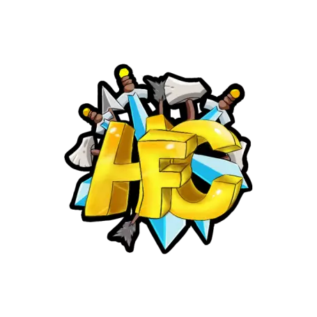

<!-- HTML:START -->

  <!-- TITLE:START --> 
  <h1>HFCraft 👋</h1>
  <h3>Um servidor construido pela comunidade!</h4>
  <h4>Sobre esse organização, essa é a organização do servidor HFCraft!</h4>
  <!-- TITLE:END --> 

  <!-- BADGES:START -->
  <a href="https://discord.gg/xVZNFtKgSs"/>
  
  <!-- -->
  <a href="https://twitch.tv/antonyzera"/>
  
  <!-- BADGES:END --> 

  